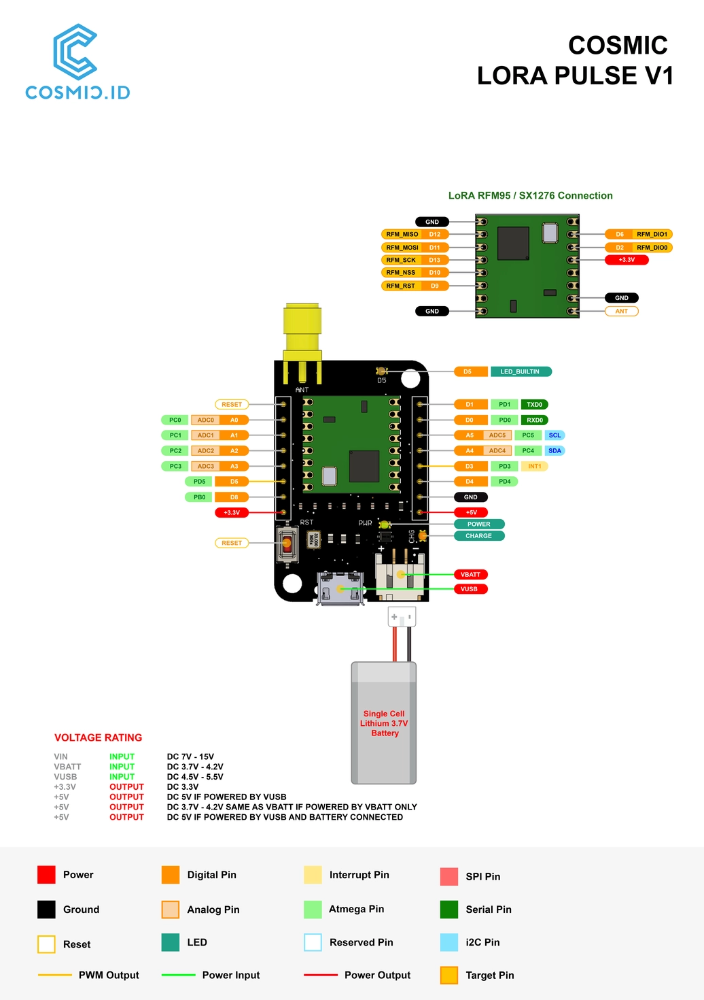

# Cosmic LoRa Pulse

## Overview

Cosmic LoRa Pulse is an Entry-Level Development Board that will fasten your time to market or ease your DIY project. It has the smallest form factor all of Cosmic LoRa Development Board line up. Hence, you can reside this board in the dimension-constrained spot. It is also armed with a low-power microcontroller ATMega 328 with Pro Mini bootloader just like [Cosmic LoRa Ray](https://github.com/farizalemuda/cosmic-lora-ray). The low-power feature then amplified with the selection of 8 MHz crystal clock to make it consume less power. Furthermore, the board works with 3.3V which can be found on rechargeable LiPo battery and solar panel. Hence, Cosmic LoRa Pulse already had the on-board charging module with USB as the source. Speaking about the connectivity as part of the a-must IoT capability, the board equipped with LoRa(WAN) module of [RFM95W](https://cdn.sparkfun.com/assets/learn_tutorials/8/0/4/RFM95_96_97_98W.pdf). LoRa(WAN) has a good reputation for low power consumption, making this board even more useful in a low power ecosystem. In conclusion, this is the most go-to board for your IoT applications.

> Cosmic are universe so our products name are based on the universe

[Dokumentasi dalam bahasa Indonesia](id/)

## Table of Content

* [Spesification](#spesification)
  * [Featured Spesification](#featured-spesification)
  * [Electrical Spesification](#electrical-spesification)
  * [LoRa(WAN) Spesification](#lora-specification)
* [Documentation](#documentation)
  * [Pinout Diagram](#pinout-diagram)
  * [Cosmic Pulse Chip Interfacing](#cosmic-pulse-chip-interfacing)
  * [Examples](#examples)
* [I wanna buy](https://www.tokopedia.com/cosmic-iot/lora-pulse-development-board-915-mhz-915mhz-1730943432887207562)
* [FAQ](#FAQ)

## Spesification

### Featured Spesification
| Feature                 |                    V3              | V2, V1 |  
| ----------------------- | --------------------------------------- |----------------|
| **Microcontroller**         |                    ❗ATmega 328PB❗          | ❗ATmega 328P❗ |
| **Bootloader**              |                    ❗[urboot](https://github.com/stefanrueger/urboot/)❗            | ❗Pro Mini❗ | 
| **Clock Speed**             |                    8 MHz                | 8 MHz |
| **LoRa(WAN)** | RFM95W | RFM95W |

### Electrical Spesification

> Allied to Cosmic LoRa Pulse all versions

* USB Voltage Input : 4.5-5.5 V          
* Battery Voltage Input : 3.7-4.2 V
* Dig. Input/Output Voltage : 3.3 V  
* Analog Input Voltage : 0-3.3 V 
* Analog-Digital-Converter (ADC) Resolution : 10 bit
* Max Output Current : 600 mA
* Charging Rate : 200 mA      

### LoRa Specification

> Allied to Cosmic LoRa Pulse all versions

* LoRa(WAN) Chip : RFM95W           
* LoRa(WAN) Base Freq : 915 MHz          
* LoRa(WAN) Freq Range : 902-928 MHz   
* Antenna Impedance : 50 Ohm

### Mechanical Spesification

> Allied to Cosmic LoRa Pulse all versions

* Length : 25.5 mm
* Width  : 39.75 mm
* Weight :  8 gram

## Documentation

### Pinout Diagram

> Click image for higher resolution

### Cosmic Pulse Chip Interfacing

| Cosmic Pulse  | V3 | V2 | V1 | 
|---------------|----|----|----|
| LORA - MOSI   | 11 | 11 | 11 | 
| LORA - MISO   | 12 | 12 | 12 |
| LORA - SCK    | 13 | 13 | 13 |
| LORA - NSS    | 10 | 10 | 10 |
| LORA - RST    | 9  | 9  | 9  |
| LORA - DIO0   | 2  | 2  | 2  |
| LORA - DIO1   | 6  | 6  | 6  |
| LED           | 8  | 5  | 5  |

### Examples

* [LoRa Point-to-Point](LoRa-P2P.md)
* [LoRaWAN ANTARES](LoRaWAN-ANTARES.md)
* Blinking LED
  * [V3](examples/Blinking_LED/Blinking_LED_V3.ino)
  * [V2, v1](examples/Blinking_LED/Blinking_LED_V1_V2.ino)

## FAQ

On-going
